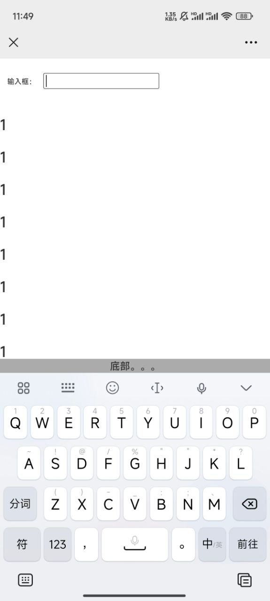
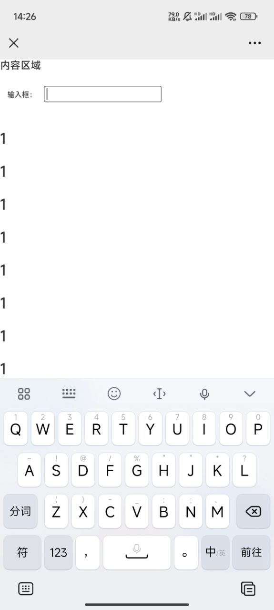

#### 简介

本文主要解决两个问题，一是键盘唤醒后底部内容被顶到键盘上方，另一个是键盘唤醒后遮挡底部输入框。(app内和app外都解决方案都有阐述)

#### 背景

在前端交流群里遇到一位碰到此类问题的开发者，勾起了我自己之前也遇到过类似的问题，便想着写一篇blog来记录一下。

#### 主要内容

<br/>

##### 一、键盘唤醒后底部内容被顶到键盘上方

> 在app内部嵌入的h5页面可以和原生ios及安卓沟通 来实现 即
>
> 安卓和ios打开webview的沉浸式模式（我理解的沉浸式--会移除嵌入h5页面自带的导航条），可以避免web页面唤醒键盘时底部内容被顶到键盘上方。

目前这种情况只在安卓浏览器中出现



那么，这个样子我们是不能接受的。

> 目前摆在我们面前的问题有两个：
> 1. 如何监听键盘弹起
> 2. 怎样使底部浮动内容不会出现在我们的键盘上方
<br/>

第一步 监听键盘弹起有两种方式：

```tsx
//第一种
const originalHeight = document.documentElement.clientHeight || document.body.clientHeight
window.onresize = () => {
return (() => {
  //软键盘弹起与隐藏都会引起窗口的高度发生变化
  const resizeHeight = document.documentElement.clientHeight || document.body.clientHeight
  console.log('进入到判断页面高度=========')
  console.log('软键盘弹起高度=========' + resizeHeight)
  if (resizeHeight - 0 < originalHeight - 0) {
    //当软键盘弹起，在此处操作
    console.log('进入到软键盘弹起=========')
  } else {
    //当软键盘收起，在此处操作
    console.log('进入到软键盘收起=========')
  }
})()
}
//第二种 这种方法仅适用于单个输入框，在ios移动端富文本编辑器中使用会存在一些问题（谨慎使用）
const onBlur = ()=>{
// 输入框失去焦点
}
const onFocus = ()=>{
// 输入框获得焦点 唤醒软键盘
}

<label className="px-[20px]" htmlFor="">
    <span className="text-[20px]">输入框：</span>
    <input className="my-[40px] ml-[20px]" type="text" onFocus={onFocus} onBlur={onBlur} />
</label>
```
<br/>

第二步 怎样使底部浮动内容不会出现在我们的键盘上方，最简单的方法当然是直接控制浮动内容隐藏（直接添加css样式即可）


<br/>

##### 二、键盘唤醒后遮挡底部输入框（仅在app内部会出现）

> 在app内部嵌入的h5页面可以和原生ios及安卓沟通 来实现 即
>
> 安卓和ios关闭webview的沉浸式模式（我理解的沉浸式--会移除嵌入h5页面自带的导航条），可以使web页面唤醒键盘时底部内容被顶到键盘上方。

在ios中即使键盘弹起输入框的位置也正常，但是我们任然需要处理页面的滚动事件（如需要滚动则不处理）。

```tsx
	//仅在ios中 当键盘弹起，我们需要禁止页面滚动
  const stop = (e: Event) => {
    e.preventDefault() // 阻止默认的处理方式(阻止下拉滑动的效果)
  }
	//唤醒软键盘
  const onFocus = () => {
    // 输入框获得焦点 唤醒输入框
    document.addEventListener('touchmove', stop, {
      passive: false,
    })
  }
	//键盘收起
  const onBlur = () => {
    // 输入框失去焦点
    document.removeEventListener('touchmove', stop)
  }
```
<br/>

#### **总结**
以上便是这两个问题的解决方案。又可以快乐的<s>写代码</s>(摸鱼)咯。。。