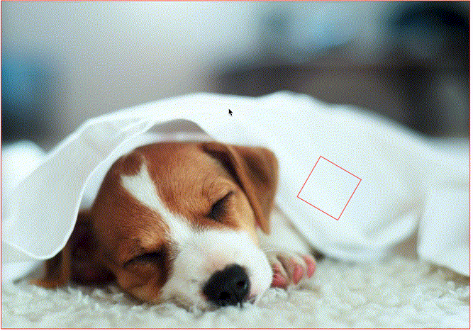
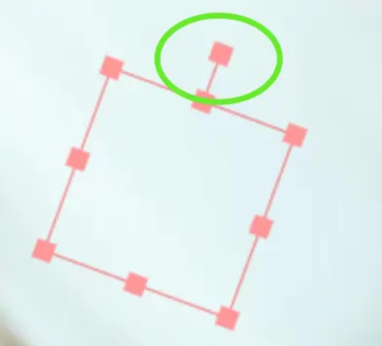
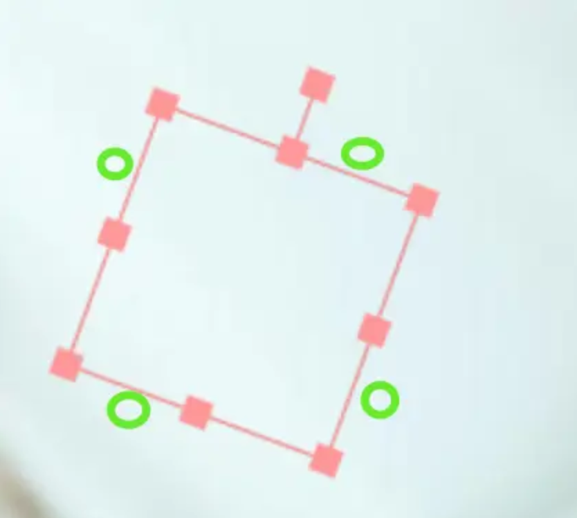

## 简介
在react用canvas实现图片标注功能，可保存编辑图片到本地

本文用到的技术栈:React+Tailwindcss+Canvas+Typescript
><a href="/demo/image_captions" target="_blank">链接直达案例</a>

## 主要内容

1. [渲染图片](#渲染图片)
2. [图片缩放](#图片缩放)
3. [移动视口图片](#移动视口图片)
4. [绘制标注](#绘制标注)
5. [添加标注](#添加标注)
6. [选取标注](#选取标注)
7. [移动标注](#移动标注)
8. [改变标注大小尺寸](#改变标注大小尺寸)
9. [旋转标注](#旋转标注)
10. [删除标注](#删除标注)
11. [实现上传编辑图片](#实现上传编辑图片)
12. [实现下载编辑后的图片](#实现下载编辑后的图片)

<br/>

### 渲染图片

本文我们不讲解 canvas 基础，如果你不了解 canvas，可以先在网上找资料，简单学习下，图片的渲染非常简单，只用到一个 API，这里我们直接给出代码，示例如下：

这里我们提前准备一个 canvas，宽高设定为 688*360，这里唯一的一个知识点就是要在图片加载完成后再绘制，在生产环境中，需要注意绘制的图片不能跨域，否则会绘制失败。

```tsx
const width = 688;
const height = 360;

const src = "https://picsum.photos/688/360";

const ImageCaptions = () => {
    const canvasRef = useRef<HTMLCanvasElement | null>(null);
    const img = new Image();
    img.src = src;
    const drawImage = () => {
      img.onload = () => {
        draw();
      };
    };
    
    const draw = () => {
        console.log("draw");
        if (canvasRef.current) {
            const _width = width;
            const _height = height;
            const ctx = canvasRef.current.getContext("2d")!;
            ctx.drawImage(img, 0, 0, _width, _height);
        }
    };
    
    useEffect(() => {
        if (canvasRef.current) {
          const ctx = canvasRef.current.getContext("2d");
          if (ctx) {
            drawImage();
          }
        }
    }, []);
    
    return (
     <div className="border-[#6cc] border-solid border-[1px] overflow-hidden">
        <canvas
          className="mx-auto"
          ref={canvasRef}
          width={image?.width || width}
          height={image?.height || height}
        ></canvas>
      </div>
    )
};

export default ImageCaptions;
```

<br/>

### 图片缩放

实现图片缩放功能，我们需要了解两个关键的知识点：如何监听缩放事件和如何实现图片缩放。

先来看第一个，当用户按住alt键使用鼠标滚轮时，会触发 `wheel` 事件，我们可以通过这个事件的 `deltaY` 属性来判断用户是向上滚动（放大）还是向下滚动（缩小）。

可以看到在 wheel 事件中，我们修改了 scale 变量，这个变量会在下面用到。这里添加了对最小缩放是 1，最大缩放是 3 的限制。

```tsx
//.....  
 let scale = 1,
    scaleX = 0,
    scaleY = 0;
 const onWheel = (event: WheelEvent) => {
    if (event.altKey) {
      event.preventDefault();

      if (event.deltaY < 0) {
        console.log("放大");
        if (scale < 3) {
          scale = Math.min(scale + 0.1, 3);
          //记录鼠标位置
          scaleX = event.offsetX;
          scaleY = event.offsetY;
          draw();
        }
      } else {
        console.log("缩小");
        if (scale > 1) {
          scale = Math.max(scale - 0.1, 1);
          draw();
        }
      }
    }
 };

useEffect(() => {
    if (canvasRef.current) {
      const ctx = canvasRef.current.getContext("2d");
      if (ctx) {
        drawImage();
      }
      document.addEventListener("wheel", onWheel, { passive: false });
      return () => {
        document.removeEventListener("wheel", onWheel);
      }
    }
  }, []);

//......
```

图片缩放功能，用到了 canvas 的 scale 函数，其可以修改绘制上下文的缩放比例，示例代码如下：

我们添加了`clearRect`函数，这用来清除上一次绘制的图形，当需要重绘时，就需要使用`clearRect`函数。

这里需要注意开头和结尾的 save 和 restore 函数，因为我们会修改 scale，如果不恢复的话，其会影响下一次绘制，一般在修改上下文时，都是通过 save 和 restore 来复原的。

```tsx
const draw = () => {
    console.log("draw");
    if (canvasRef.current) {
        const _width = width;
        const _height = height;
        const ctx = canvasRef.current.getContext("2d")!;
        ctx.clearRect(0, 0, _width, _height);
        ctx.save();
        //移动缩放原点
        ctx.translate(scaleX, scaleY);
        ctx.scale(scale, scale);
        //恢复缩放原点
        ctx.translate(-scaleX, -scaleY);
        ctx.drawImage(img, 0, 0, _width, _height);
        ctx.restore();
     } 
};
```

这里稍微解释一下 scale 函数，初次接触，可能会不太好理解。在 Canvas 中使用 `scale` 函数时，重要的是要理解它实际上是在缩放绘图坐标系统，而不是直接缩放绘制的图形。当你调用 `ctx.scale(scaleX, scaleY)` 时，你是在告诉 Canvas 之后的所有绘图操作都应该在一个被缩放的坐标系统中进行。

这意味着，如果你将缩放比例设置为 2，那么在这个缩放的坐标系统中，绘制一个宽度为 50 像素的矩形，实际上会在画布上产生一个宽度为 100 像素的矩形。因为在缩放的坐标系统中，每个单位长度都变成了原来的两倍。

因此，当我们谈论 `scale` 函数时，重点是要记住它是在缩放整个绘图坐标系统，而不是单独的图形。这就是为什么在使用 `scale` 函数后，所有的绘图操作（包括位置、大小等）都会受到影响。


### 移动视口图片

先解释下放大时，可见区域的概念，好像叫视口吧 当处于放大状态时，会导致图像只能显示一部分，此时需要能过需要可以移动可见的图像， 这里选择通过鼠标拖拽实现移动视口

通过 canvas 的 translate 来实现改变视口

在图片放大后，整个图像可能无法完全显示在 Canvas 上，此时只有图像的一部分（即可见区域）会显示在画布上。这个可见区域也被称为“视口”。为了查看图像的其他部分，我们需要能够移动这个视口，即实现图片的平移功能。

在放大状态下，视口的大小相对于整个图像是固定的，但是它可以在图像上移动以显示不同的部分。你可以将视口想象为一个固定大小的窗口，你通过这个窗口来观察一个更大的图像。当你移动视口时，窗口中显示的图像部分也会相应改变。

为了实现移动视口，我们可以通过监听鼠标的事件（也就是 `mousedown`、`mousemove`和`mouseup` 事件	）来改变视口的位置。当用户按住ctrl键+鼠标左键移动鼠标时，我们可以相应地移动视口，从而实现图像的平移效果。

我们可以使用 Canvas 的 `translate` 方法来改变视口的位置。`translate` 方法接受两个参数，分别表示沿 x 轴和 y 轴移动的距离。在移动视口时，我们需要更新图片的位置，并重新绘制图像以反映新的视口位置。

```tsx
//......
let translateX = 0,  translateY = 0,isDragging = false;

const draw = () => {
    console.log("draw");
    if (canvasRef.current) {
        //......
        const ctx = canvasRef.current.getContext("2d")!;
        // 改变视口
  		ctx1.translate(translateX, translateY);
     } 
};

  const onMouseDown = (event: MouseEvent) => {
    startX = event.pageX - translateX;
    startY = event.pageY - translateY;
    isDragging = true;
  };

  const onMouseMove = (event: MouseEvent) => {
    if (event.ctrlKey && isDragging) {
      event.preventDefault();
      translateX = event.pageX - startX;
      translateY = event.pageY - startY;
      draw();
    }
  };

  const onMouseUp = (event: MouseEvent) => {
    isDragging = false;
  };


useEffect(() => {
    if (canvasRef.current) {
      const ctx = canvasRef.current.getContext("2d");

      if (ctx) {
        drawImage();
      }

      document.addEventListener("wheel", onWheel, { passive: false });
      canvasRef.current.addEventListener("mousedown", onMouseDown, {
        passive: false,
      });
      canvasRef.current.addEventListener("mousemove", onMouseMove, {
        passive: false,
      });
      canvasRef.current.addEventListener("mouseup", onMouseUp, {
        passive: false,
      });
      return () => {
        document.removeEventListener("wheel", onWheel);
        canvasRef.current?.removeEventListener("mousedown", onMouseDown);
        canvasRef.current?.removeEventListener("mousemove", onMouseMove);
        canvasRef.current?.removeEventListener("mouseup", onMouseUp);
      };
    }
 }, []);

//......
```

在这个示例中，`translateX` 和 `translateY` 表示视口的位置。当用户按住ctrl键+鼠标左键移动鼠标时，我们根据滑动的方向和距离更新视口的位置，并重新绘制图像。通过这种方式，我们可以实现图像的平移功能，允许用户查看图像的不同部分


### 绘制标注

为了便于大家理解，这里我们仅实现矩形标注示例，实际业务中可能存在各种图形的标记，比如圆形，椭圆，直线，曲线，自定义图形等。

我们先考虑矩形标注的绘制问题，由于 canvas 是位图，我们需要在 js 中存储矩形的数据，矩形的存储需要支持坐标，尺寸，旋转角度和是否在编辑中等。因为可能存在多个标注，所以需要一个数组来存取标注数据，我们将标注存储在`signs`中，示例如下：

```tsx
type DrawingSign = {
  x: number;
  y: number;
  width: number;
  height: number;
  isEditing?: boolean;
  rotatable?: boolean;
  rotateAngle?: number;
  type?: string;
}
//....

let signs: DrawingSign[] = [
      {
        x: 300,
        y: 200,
        width: 100,
        height: 100,
        isEditing: false,
        rotatable: true,
        rotateAngle: 20,
      },
    ];
```

下面将 signs 渲染到 canvas 中，示例代码如下：

代码扩机并不复杂，比较容易理解，值得一提的`rotateAngle`的实现，我们通过旋转上下文来实现，其旋转中心是矩形的图形的中心点，因为操作上线文，所以在每个矩形绘制开始和结束后，要通过`save`和`restore`来恢复之前的上下文。

`isEditing`表示当前的标注是否处于编辑状态，在这里编辑中的矩形框，我们只需设置不同的颜色即可，在后面我们会实现编辑的逻辑。

```tsx
const draw = () => {
    console.log("draw");
    if (canvasRef.current) {
        //......
        const ctx = canvasRef.current.getContext("2d")!;
        // 改变视口
  		ctx1.translate(translateX, translateY);
        ctx.drawImage(img, 0, 0, _width, _height);
      	signs.forEach((r) => {
            ctx.strokeStyle = r.isEditing
              ? "rgba(102, 205, 204, 1)"
              : "rgba(255, 0, 0)";

            ctx.save();
            if (r.rotatable) {
              ctx.translate(r.x + r.width / 2, r.y + r.height / 2);
              ctx.rotate((r.rotateAngle! * Math.PI) / 180);
              ctx.translate(-(r.x + r.width / 2), -(r.y + r.height / 2));
            }
            ctx.strokeRect(r.x, r.y, r.width, r.height);
            ctx.restore();
          });
        ctx.restore();
     } 
};
```

<br/>

### 添加标注

为了在图片上添加标注，我们需要实现鼠标按下、移动和抬起时的事件处理，以便在用户拖动鼠标时动态地绘制一个矩形标注。同时，由于视口可以放大和移动，我们还需要进行坐标的换算，确保标注的位置正确。

首先，我们需要定义一个变量 `drawingRect` 来存储正在添加中的标注数据。这个变量将包含标注的起始坐标、宽度和高度等信息：

```
let drawingRect = null;
```

接下来，我们需要实现鼠标按下、移动和抬起的事件处理函数：

`pointerdown`中我们需要记录鼠标按下时，距离视口左上角的坐标，并将其记录到全局变量`startX`和`startY`中。

`pointermove`时，需要更新当前在绘制矩形的数据，并调用`draw`完成重绘。

`pointerup`时，需要处理添加操作，将矩形添加到`sgins`中，在这里我做了一个判断，如果矩形的宽高小于 1，则不添加，这是为了避免在鼠标原地点击时，误添加图形的问题。

```tsx
let sginStartX = 0, sginStartY = 0,;
let drawingSign: DrawingSign | null = null;
const onPointerDown = (event: PointerEvent) => {
    if (event.altKey) {
      const _x = event.offsetX;
      const _y = event.offsetY;
      sginStartX = _x;
      sginStartY = _y;
      const { x, y } = computexy(_x, _y);

      drawingSign = drawingSign || ({} as any);
      console.log("mousedown");
    }
 };
 const onPointerMove = (event: PointerEvent) => {
    const { x, y } = computexy(event.offsetX, event.offsetY);
    if (event.altKey) {
      if (drawingSign) {
        drawingSign = computeRect({
          x: sginStartX,
          y: sginStartY,
          width: event.offsetX - sginStartX,
          height: event.offsetY - sginStartY,
        });
        draw();
        return;
      }
    }
 };
 const onPointerUP = (event: PointerEvent) => {
    if (drawingSign) {
      drawingSign = null;
      // 如果绘制的矩形太小，则不添加，防止原地点击时添加矩形
      // 如果反向绘制，则调整为正向
      const width = Math.abs(event.offsetX - sginStartX);
      const height = Math.abs(event.offsetY - sginStartY);
      if (width > 1 || height > 1) {
        const newrect = computeRect({
          x: Math.min(sginStartX, event.offsetX),
          y: Math.min(sginStartY, event.offsetY),
          width,
          height,
        });
        signs.push(newrect as any);
        draw();
      }
      return;
    }
 };

useEffect(() => {
    if (canvasRef.current) {
      const ctx = canvasRef.current.getContext("2d");

      if (ctx) {
        drawImage();
      }
		//......
      canvasRef.current.addEventListener("pointerdown", onPointerDown, {
        passive: false,
      });
      canvasRef.current.addEventListener("pointermove", onPointerMove, {
        passive: false,
      });
      canvasRef.current.addEventListener("pointerup", onPointerUP, {
        passive: false,
      });
      return () => {
          //.......
        canvasRef.current?.removeEventListener("pointerdown", onPointerDown);
        canvasRef.current?.removeEventListener("pointermove", onPointerMove);
        canvasRef.current?.removeEventListener("pointerup", onPointerUP);
      };
    }
 }, []);

```

下面我们来重点讲讲上面的`computexy`和`computeRect`函数，由于视口可以放大和移动，我们需要将鼠标点击时的视口坐标换算为 Canvas 坐标系的坐标。

宽高的计算比较简单，只需要将视口坐标除以缩放比例即可得到。但坐标的计算并不简单，这里通过视口坐标，直接去推 canvas 坐标是比较困难的，我们可以求出 canvas 坐标计算视口坐标的公式，公式推导如下：

```
vx: 视口坐标
x: canvas坐标
scale: 缩放比例
scaleX: 缩放原点
translateX: 视口移动位置

我们x会在如下视口操作后进行渲染成vx：
1: ctx1.translate(scaleX, scaleY);
2: ctx1.scale(scale, scale);
3: ctx1.translate(-scaleX, -scaleY);
4: ctx1.translate(translateX, translateY);

根据上面的步骤，每一步vx的推演如下：
1: vx = x + scaleX
2: vx = x * scale + scaleX
3: vx = x * scale + scaleX - scaleX * scale
4: vx = x * scale + scaleX - scaleX * scale + translateX * scale
```

通过上面 vx 和 x 的公式，我们可以计算出来 x 和 vx 的关系如下，我在这里走了很多弯路，导致计算的坐标一直不对，不要试图通过 vx 直接推出 x，一定要通过上面的公式来推导：

```
x = (vx - scaleX * (1 - scale) - translateX * scale) / scale
```

理解了上面坐标和宽高的计算公式，下面的代码就好理解了：

```tsx
  const computexy = (x: number, y: number) => {
    return {
      x: (x - scaleX * (1 - scale) - translateX * scale) / scale,
      y: (y - scaleY * (1 - scale) - translateY * scale) / scale,
    };
  };

  const computewh = (width: number, height: number) => {
    return {
      width: width / scale,
      height: height / scale,
    };
  };

  const computeRect = (rect: {
    x: number;
    y: number;
    width: number;
    height: number;
  }) => {
    return {
      ...computexy(rect.x, rect.y),
      ...computewh(rect.width, rect.height),
    };
  };
```

最后，我们需要一个函数来绘制标注矩形：

```tsx
const draw = () => {
    console.log("draw");
    if (canvasRef.current) {
        const ctx = canvasRef.current.getContext("2d");
        //......
        if (drawingSign) {
            ctx.strokeRect(
              drawingSign.x,
              drawingSign.y,
              drawingSign.width,
              drawingSign.height
            );
        }
        ctx.restore();
     } 
};
```

<br/>



### 选取标注

判断选中，将视口坐标，转换为 canvas 坐标，遍历矩形，判断点在矩形内部 同时需要考虑点击空白处，清空选中状态 选中其他元素时，清空上一个选中的元素 渲染选中状态，选中状态改变边的颜色，为了明显，红色变为蓝色 要是先选取元素的功能，关键要实现的判断点在矩形内部，判断点在矩形内部的逻辑比较简单，我们可以抽象为如下函数：

```tsx
//判断 是否选中标注
const judgePosition = (x: number, y: number, sgin: DrawingSign) => {
    return (
      x >= sgin.x &&
      x <= sgin.x + sgin.width &&
      y >= sgin.y &&
      y <= sgin.y + sgin.height
    );
};
```

在点击事件中，我们拿到的是视口坐标，首先将其转换为 canvas 坐标，然后遍历矩形数组，判断是否有中选的矩形，如果有的话将其存储下来。

还需要考虑点击新元素时，和点击空白时，重置上一个元素的选中态的逻辑，代码实现如下所示：

```tsx
  const onPointerDown = (event: PointerEvent) => {
    if (event.altKey) {
      const _x = event.offsetX;
      const _y = event.offsetY;
      sginStartX = _x;
      sginStartY = _y;
      const { x, y } = computexy(_x, _y);

      const pickSgin = signs.find((s) => judgePosition(x, y, s));
      if (pickSgin) {
        if (editSign && pickSgin !== editSign) {
          editSign.isEditing = false;
          editSign = null;
        }
        editSign = pickSgin;
        editSign.isEditing = true;
        draw();
      } else {
        if (editSign) {
          editSign.isEditing = false;
          editSign = null;
          draw();
        }
        drawingSign = drawingSign || ({} as any);
      }

      console.log("mousedown");
    }
  };
```

<br/>


### 移动标注

接下来是移动，也就是通过拖拽来改变已有图形的位置 首先需要一个变量来存取当前被拖拽元素，在 down 和 up 时更新这个元素 要实现拖拽，需要一点小技巧，在点击时，计算点击点和图形左上角的坐标差，在每次 move 时，用当前坐标减去坐标差即可 不要忘了将视口坐标，换算为 canvas 坐标哦

接下来，我们将实现通过拖拽来改变已有标注的位置的功能。这需要跟踪当前被拖拽的标注，并在鼠标移动时更新其位置。

首先，我们需要一个变量来存储当前被拖拽的标注：

```
let draggingRect = null;
```

在鼠标按下时（`pointerdown` 事件），我们需要判断是否点击了某个标注，并将其设置为被拖拽的标注，并在鼠标抬起时（`pointerup` 事件），将其置空。

要实现完美的拖拽效果，需要一点小技巧，在点击时，计算点击点和图形左上角的坐标差，将其记录到全局变量`shiftX`和`shiftY`，关键代码如下所示。

```tsx
let shiftX = 0;
let shiftY = 0;

  const onPointerDown = (event: PointerEvent) => {
    if (event.altKey) {
      const _x = event.offsetX;
      const _y = event.offsetY;
      sginStartX = _x;
      sginStartY = _y;
      const { x, y } = computexy(_x, _y);

      const pickSgin = signs.find((s) => judgePosition(x, y, s));
      if (pickSgin) {
        if (editSign && pickSgin !== editSign) {
          editSign.isEditing = false;
          editSign = null;
        }
        //计算坐标差
        shiftX = x - pickSgin.x;
        shiftY = y - pickSgin.y;
        //记录当前拖拽标注
        draggingSign = pickSgin;
          
        editSign = pickSgin;
        editSign.isEditing = true;
        draw();
      } else {
        if (editSign) {
          editSign.isEditing = false;
          editSign = null;
          draw();
        }
        drawingSign = drawingSign || ({} as any);
      }

      console.log("mousedown");
    }
  };
  
  const onPointerUP = (event: PointerEvent) => {

    if (draggingSign) {
      draggingSign = null;
      return;
    }
    //....
  };

```

在鼠标移动时（`pointermove` 事件），如果有标注被拖拽，则更新其位置，关键代码如下所示

```tsx
 const onPointerMove = (event: PointerEvent) => {
    const { x, y } = computexy(event.offsetX, event.offsetY);
    if (event.altKey) {
      if (drawingSign) {
        drawingSign = computeRect({
          x: sginStartX,
          y: sginStartY,
          width: event.offsetX - sginStartX,
          height: event.offsetY - sginStartY,
        });
        draw();
        return;
      }
      if (draggingSign) {
        draggingSign.x = x;
        draggingSign.y = y;
        draw();
        return;
      }
    }
 };
```

<br/>


### 改变标注大小尺寸

为了实现标注尺寸的修改功能，我们可以在标注的四个角和四条边的中点处显示小方块作为编辑器，允许用户通过拖拽这些小方块来改变标注的大小。

首先，我们需要实现编辑器的渲染逻辑。我们可以在 `drawEditor` 函数中添加代码来绘制这些小方块。

在这里，我们使用 `computeEditRect` 函数来计算标注的八个编辑点的位置，并在 `drawEditor` 函数中绘制这些小方块，关键代码如下所示：

```tsx
  const computedEditSgin = (rect: DrawingSign) => {
    const width = 10;
    const linelen = 16;
    return {
      top: {
        type: "top",
        x: rect.x + rect.width / 2 - width / 2,
        y: rect.y - width / 2,
        width,
        height: width,
      },
      right: {
        type: "right",
        x: rect.x + rect.width - width / 2,
        y: rect.y + rect.height / 2 - width / 2,
        width,
        height: width,
      },
      bottom: {
        type: "bottom",
        x: rect.x + rect.width / 2 - width / 2,
        y: rect.y + rect.height - width / 2,
        width,
        height: width,
      },
      left: {
        type: "left",
        x: rect.x - width / 2,
        y: rect.y + rect.height / 2 - width / 2,
        width,
        height: width,
      },
      leftTop: {
        type: "leftTop",
        x: rect.x - width / 2,
        y: rect.y - width / 2,
        width,
        height: width,
      },
      rightTop: {
        type: "rightTop",
        x: rect.x + rect.width - width / 2,
        y: rect.y - width / 2,
        width,
        height: width,
      },
      rightBottom: {
        type: "rightBottom",
        x: rect.x + rect.width - width / 2,
        y: rect.y + rect.height - width / 2,
        width,
        height: width,
      },
      leftBottom: {
        type: "leftBottom",
        x: rect.x - width / 2,
        y: rect.y + rect.height - width / 2,
        width,
        height: width,
      },
    };
  };

const drawEditor = (rect: DrawingSign) => {
    if (canvasRef.current) {
      const ctx = canvasRef.current.getContext("2d")!;
      ctx.save();
      const editor = computedEditSgin(rect);
      ctx.fillStyle = "rgba(102, 205, 204, 1)";
      const { rotLine, rotRect, ...rects } = editor;
      for (const iterator of Object.values(rects)) {
        ctx.fillRect(iterator.x, iterator.y, iterator.width, iterator.height);
      }
      ctx.restore();
    }
};

const draw = () => {
    console.log("draw");
    if (canvasRef.current) {
        const ctx = canvasRef.current.getContext("2d");
        //......
        signs.forEach((r) => {
       		//.....
            if (r.isEditing) {
              drawEditor(r);
            }
            ctx.restore();
        });
      //......
     } 
};
```

接下来，我们需要实现拖动这些编辑点来改变标注大小的功能。首先，我们需要在鼠标按下时判断是否点击了某个编辑点。

在这里，我们使用 `poInEditor` 函数来判断鼠标点击的位置是否接近某个编辑点。如果是，则设置 `startEditRect`, `dragingEditor`, `editorShiftXY` 来记录正在调整大小的标注和编辑点。

```tsx
let startEditSgin: DrawingSign | null = null;
let dragingEditor: DrawingSign | null = null;
let editorShiftX = 0, editorShiftY = 0;

const poInEditor = (point: Record<string, number>, sgin: DrawingSign) => {
    const editor = computedEditSgin(sgin);
    if (!editor) return;
    for (const iterator of Object.values(editor)) {
      if (
        judgePosition(
          point,
          iterator
        )
      ) {
        return iterator;
      }
    }
};

const onPointerDown = (event: PointerEvent) => {
    if (event.altKey) {
      const _x = event.offsetX;
      const _y = event.offsetY;
      sginStartX = _x;
      sginStartY = _y;
      const { x, y } = computexy(_x, _y);
      //.....
      if (editSign) {
        const editor: any = poInEditor({ x, y }, editSign);
        if (editor) {
          startEditSgin = { ...editSign };
          dragingEditor = editor;
          editorShiftX = x - editor.x;
          editorShiftY = y - editor.y;
          return;
        }
      }
      console.log("mousedown");
    }
};


```

然后，在鼠标移动时，我们需要根据拖动的编辑点来调整标注的大小。

通过拖动不同的编辑点，我们可以实现标注的不同方向和维度的大小调整。

```tsx
  const onPointerMove = (event: PointerEvent) => {
    const { x, y } = computexy(event.offsetX, event.offsetY);
    if (event.altKey) {
       //......
      // 如果存在编辑中的元素
      if (editSign) {
        const editor = poInEditor({ x, y }, editSign);
        // 调整大小中
        if (dragingEditor) {
          const moveX = (event.offsetX - sginStartX) / scale;
          const moveY = (event.offsetY - sginStartY) / scale;

          switch (dragingEditor.type) {
            case "top":
              editSign.y = startEditSgin!.y + moveY;
              editSign.height = startEditSgin!.height - moveY;
              break;
            case "right":
              editSign.width = startEditSgin!.width + moveX;
              break;
            case "bottom":
              editSign.height = startEditSgin!.height + moveY;
              break;
            case "left":
              editSign.x = startEditSgin!.x + moveX;
              editSign.width = startEditSgin!.width - moveX;
              break;
            case "leftTop":
              editSign.y = startEditSgin!.y + moveY;
              editSign.height = startEditSgin!.height - moveY;
              editSign.x = startEditSgin!.x + moveX;
              editSign.width = startEditSgin!.width - moveX;
              break;
            case "rightTop":
              editSign.width = startEditSgin!.width + moveX;
              editSign.y = startEditSgin!.y + moveY;
              editSign.height = startEditSgin!.height - moveY;
              break;
            case "rightBottom":
              editSign.width = startEditSgin!.width + moveX;
              editSign.height = startEditSgin!.height + moveY;
              break;
            case "leftBottom":
              editSign.x = startEditSgin!.x + moveX;
              editSign.width = startEditSgin!.width - moveX;
              editSign.height = startEditSgin!.height + moveY;
              break;
          }
          draw();
          return;
        }
    }
  };
```

<br/>


### 旋转标注

实现旋转编辑器的渲染按钮，在顶部增加一个小方块的方式来实现，

旋转图形会影响选中图形的逻辑，即点在旋转图形里的判断，这块的逻辑需要修改

接下来实现旋转逻辑，会涉及 pointerdown 和 pointermove

接下来介绍旋转，这一部分会有一定难度，涉及一些数学计算，而且旋转逻辑会修改多出代码，下面我们依次介绍。

旋转涉及两大块功能，一个是旋转编辑器，一个是旋转逻辑，我们先来看旋转编辑器，我们可以在标注的顶部增加一个用于旋转的小方块作为旋转编辑器



下面修改我们的`drawEditor`和`computeEditRect`函数，增加渲染逻辑，涉及一个方块和一条线的渲染。

其中`rotRect`就是顶部的方块，`rotLine`是那条竖线。

```tsx
  const computedEditSgin = (rect: DrawingSign) => {
    const width = 10;
    const linelen = 16;
    return {
      top: {
        type: "top",
        x: rect.x + rect.width / 2 - width / 2,
        y: rect.y - width / 2,
        width,
        height: width,
      },
      right: {
        type: "right",
        x: rect.x + rect.width - width / 2,
        y: rect.y + rect.height / 2 - width / 2,
        width,
        height: width,
      },
      bottom: {
        type: "bottom",
        x: rect.x + rect.width / 2 - width / 2,
        y: rect.y + rect.height - width / 2,
        width,
        height: width,
      },
      left: {
        type: "left",
        x: rect.x - width / 2,
        y: rect.y + rect.height / 2 - width / 2,
        width,
        height: width,
      },
      leftTop: {
        type: "leftTop",
        x: rect.x - width / 2,
        y: rect.y - width / 2,
        width,
        height: width,
      },
      rightTop: {
        type: "rightTop",
        x: rect.x + rect.width - width / 2,
        y: rect.y - width / 2,
        width,
        height: width,
      },
      rightBottom: {
        type: "rightBottom",
        x: rect.x + rect.width - width / 2,
        y: rect.y + rect.height - width / 2,
        width,
        height: width,
      },
      leftBottom: {
        type: "leftBottom",
        x: rect.x - width / 2,
        y: rect.y + rect.height - width / 2,
        width,
        height: width,
      },
      ...(rect.rotatable
        ? {
            rotLine: {
              type: "rotLine",
              x1: rect.x + rect.width / 2,
              y1: rect.y - linelen - width / 2,
              x2: rect.x + rect.width / 2,
              y2: rect.y - width / 2,
            },
            rotRect: {
              type: "rotRect",
              x: rect.x + rect.width / 2 - width / 2,
              y: rect.y - width / 2 - linelen - width,
              width,
              height: width,
            },
          }
        : null),
    };
  };

  const drawEditor = (rect: DrawingSign) => {
    if (canvasRef.current) {
      const ctx = canvasRef.current.getContext("2d")!;
      ctx.save();
      const editor = computedEditSgin(rect);
      ctx.fillStyle = "rgba(102, 205, 204, 1)";
      const { rotLine, rotRect, ...rects } = editor;

      if (rect.rotatable && rotRect && rotLine) {
        ctx.fillRect(rotRect.x, rotRect.y, rotRect.width, rotRect.height);
        ctx.beginPath();
        ctx.moveTo(rotLine.x1, rotLine.y1);
        ctx.lineTo(rotLine.x2, rotLine.y2);
        ctx.stroke();
      }
      for (const iterator of Object.values(rects)) {
        ctx.fillRect(iterator.x, iterator.y, iterator.width, iterator.height);
      }
      ctx.restore();
    }
  };

```

在实现旋转逻辑之前，先来看一个问题，如下图所示，当我们在绿色圆圈区按下鼠标时，在我们之前的逻辑中，也会触发选中状态。



这是因为我们判断点在矩形内部的逻辑，并未考虑旋转的问题，我们的矩形数据存储了矩形旋转之前的坐标和旋转角度，如下所示。

```tsx
let signs: DrawingSign[] = [
  {
    x: 300,
    y: 200,
    width: 100,
    height: 100,
    isEditing: false,
    rotatable: true,
    rotateAngle: 20,
  },
];
```

解决这个问题有两个思路，一个是将旋转后矩形的四个点坐标计算出来，这种方法比较麻烦。另一个思路是逆向的，将要判断的点，以矩形的中点为中心，做逆向旋转，计算出其在 canvas 中的坐标，这个坐标，可以继续参与我们之前点在矩形内的计算。

关键代码如下所示，其中`rotatePoint`是计算 canvas 中的坐标，`poInRotRect`判断给定点是否在旋转矩形内部。

```tsx
const rotatePoint = (
    point: Record<string, number>,
    rotateCenter: Record<string, number>,
    rotateAngle: number
) => {
    const dx = point.x - rotateCenter.x;
    const dy = point.y - rotateCenter.y;
    const deg = (-rotateAngle * Math.PI) / 180;
    const x = dx * Math.cos(deg) - dy * Math.sin(deg) + rotateCenter.x;
    const y = dx * Math.sin(deg) + dy * Math.cos(deg) + rotateCenter.y;
    return { x, y };
};

const poInRotRect = (
    point: Record<string, number>,
    rect: DrawingSign,
    rotateCenter = {
      x: rect.x + rect.width / 2,
      y: rect.y + rect.height / 2,
    },
    rotateAngle = rect.rotateAngle
) => {
    if (rotateAngle) {
      const rotatedPoint = rotatePoint(point, rotateCenter, rotateAngle);
      const res = judgePosition(rotatedPoint.x, rotatedPoint.y, rect);
      return res;
    }
    return judgePosition(point.x, point.y, rect);
};
```

接下来实现旋转逻辑，这需要改在 pointerdown 和 pointermove 事件，实现拖动时的实时旋转。

在 pointerdown 时，判断如果点击的是旋转按钮，则将当前矩形记录到全局变量`rotatingRect`。

```tsx

  const onPointerDown = (event: PointerEvent) => {
    if (event.altKey) {
      const _x = event.offsetX;
      const _y = event.offsetY;
      sginStartX = _x;
      sginStartY = _y;
      const { x, y } = computexy(_x, _y);

      if (editSign) {
        const editor: any = poInEditor({ x, y }, editSign);
        if (editor) {
          //执行旋转
          if (editor.type === "rotRect") {
            rotatingRect = editSign;
            prevX = _x;
            prevY = _y;
            return;
          }
          startEditSgin = { ...editSign };
          dragingEditor = editor;
          editorShiftX = x - editor.x;
          editorShiftY = y - editor.y;
          return;
        }
      }

      const pickSgin = signs.find((s) => judgePosition(x, y, s));
      if (pickSgin) {
        if (editSign && pickSgin !== editSign) {
          editSign.isEditing = false;
          editSign = null;
        }

        shiftX = x - pickSgin.x;
        shiftY = y - pickSgin.y;
        draggingSign = pickSgin;

        editSign = pickSgin;
        editSign.isEditing = true;
        draw();
      } else {
        if (editSign) {
          editSign.isEditing = false;
          editSign = null;
          draw();
        }
        drawingSign = drawingSign || ({} as any);
      }

      console.log("mousedown");
    }
  };
```

在 pointermove 时，判断如果是位于旋转按钮上，则计算旋转角度。

```tsx
  const onPointerMove = (event: PointerEvent) => {
    const { x, y } = computexy(event.offsetX, event.offsetY);
    if (event.altKey) {
      if (editSign) {
        const editor = poInEditor({ x, y }, editSign);
        if (dragingEditor) {
          const moveX = (event.offsetX - sginStartX) / scale;
          const moveY = (event.offsetY - sginStartY) / scale;
          console.log(dragingEditor.type);

          switch (dragingEditor.type) {
            case "top":
              editSign.y = startEditSgin!.y + moveY;
              editSign.height = startEditSgin!.height - moveY;
              break;
            case "right":
              editSign.width = startEditSgin!.width + moveX;
              break;
            case "bottom":
              editSign.height = startEditSgin!.height + moveY;
              break;
            case "left":
              editSign.x = startEditSgin!.x + moveX;
              editSign.width = startEditSgin!.width - moveX;
              break;
            case "leftTop":
              editSign.y = startEditSgin!.y + moveY;
              editSign.height = startEditSgin!.height - moveY;
              editSign.x = startEditSgin!.x + moveX;
              editSign.width = startEditSgin!.width - moveX;
              break;
            case "rightTop":
              editSign.width = startEditSgin!.width + moveX;
              editSign.y = startEditSgin!.y + moveY;
              editSign.height = startEditSgin!.height - moveY;
              break;
            case "rightBottom":
              editSign.width = startEditSgin!.width + moveX;
              editSign.height = startEditSgin!.height + moveY;
              break;
            case "leftBottom":
              editSign.x = startEditSgin!.x + moveX;
              editSign.width = startEditSgin!.width - moveX;
              editSign.height = startEditSgin!.height + moveY;
              break;
          }
          draw();
          return;
        }
        if (rotatingRect) {
          const _x = event.offsetX;
          const _y = event.offsetY;
          const relativeAngle = getRelativeRotationAngle(
            computexy(_x, _y),
            computexy(prevX, prevY),
            {
              x: editSign.x + editSign.width / 2,
              y: editSign.y + editSign.height / 2,
            }
          );
          console.log("relativeAngle", relativeAngle);
          editSign.rotateAngle! += (relativeAngle * 180) / Math.PI;
          prevX = _x;
          prevY = _y;

          draw();
          return;
        }
      }
      if (draggingSign) {
        draggingSign.x = x;
        draggingSign.y = y;
        draw();
        return;
      }
      if (drawingSign) {
        drawingSign = computeRect({
          x: sginStartX,
          y: sginStartY,
          width: event.offsetX - sginStartX,
          height: event.offsetY - sginStartY,
        });
        draw();
        return;
      }
    }
  };
```

将拖拽移动的距离，转换为旋转的角度，涉及一些数学知识，其原理是通过上一次鼠标位置和本次鼠标位置，计算两个点和旋转中心（矩形的中心）三个点，形成的夹角，示例代码如下：

```tsx
  const getRelativeRotationAngle = (
    point: Record<string, number>,
    prev: Record<string, number>,
    center: Record<string, number>
  ) => {
    // 计算上一次鼠标位置和旋转中心的角度
    let prevAngle = Math.atan2(prev.y - center.y, prev.x - center.x);

    // 计算当前鼠标位置和旋转中心的角度
    let curAngle = Math.atan2(point.y - center.y, point.x - center.x);

    // 得到相对旋转角度
    let relativeAngle = curAngle - prevAngle;

    return relativeAngle;
  };
```

<br/>


### 删除标注

删除标注的前提是先选中标注，再删除，在选中标注之后按下delete键删除标注。我们可以监听键盘的`keydown`事件来实现按下delete键删除选中标注

```tsx
const onDelete = (event:KeyboardEvent)=>{
    if(editSign&&event.code==='Delete'){
      const list = signs.filter(s=>s!==editSign)
      signs=list
      draw()
    }
}

useEffect(() => {
    if (canvasRef.current) {
      const ctx = canvasRef.current.getContext("2d");

      if (ctx) {
        drawImage();
      }
      //......
      document.addEventListener("keydown", onDelete, {
        passive: false,
      });
      return () => {
        //......
        document.removeEventListener("keydown", onDelete);
      };
    }
}, []);
```

<br/>

### 实现上传编辑图片

上传图片可以用`input`标签来实现，用户点击上传图片选中图片后，`input`标签的`onchange`事件会触发，我们就可以拿到对应的图片文件，之后将其用canvas渲染在页面中，即可进行图片标注。

```tsx
//......
const ImageCaptions = () => {
  const canvasRef = useRef<HTMLCanvasElement | null>(null);
  const [image, setImage] = useState<{
    src: string;
    width: number;
    height: number;
  } | null>(null);
  const drawImage = () => {
    if (image) {
      img.src = image.src;
      img.onload = () => {
        draw();
      };
    } else {
      img.onload = () => {
        draw();
      };
    }
  };
 const draw = () => {
    console.log("draw");
    if (canvasRef.current) {
      const _width = image?.width || width;
      const _height = image?.height || height;
      const ctx = canvasRef.current.getContext("2d")!;
      ctx.clearRect(0, 0, _width, _height);
      ctx.save();
      ctx.translate(scaleX, scaleY);
      ctx.scale(scale, scale);
      ctx.translate(-scaleX, -scaleY);
      ctx.translate(translateX, translateY);
      ctx.drawImage(img, 0, 0, _width, _height);
      signs.forEach((r) => {
        ctx.strokeStyle = r.isEditing
          ? "rgba(102, 205, 204, 1)"
          : "rgba(255, 0, 0)";

        ctx.save();
        if (r.rotatable) {
          ctx.translate(r.x + r.width / 2, r.y + r.height / 2);
          ctx.rotate((r.rotateAngle! * Math.PI) / 180);
          ctx.translate(-(r.x + r.width / 2), -(r.y + r.height / 2));
        }
        ctx.strokeRect(r.x, r.y, r.width, r.height);

        if (r.isEditing) {
          drawEditor(r);
        }
        ctx.restore();
      });
      if (drawingSign) {
        ctx.strokeRect(
          drawingSign.x,
          drawingSign.y,
          drawingSign.width,
          drawingSign.height
        );
      }
      ctx.restore();
    }
  };
    //......
 useEffect(() => {
    if (canvasRef.current) {
      const ctx = canvasRef.current.getContext("2d");

      if (ctx) {
        drawImage();
      }

      document.addEventListener("wheel", onWheel, { passive: false });
      canvasRef.current.addEventListener("mousedown", onMouseDown, {
        passive: false,
      });
      canvasRef.current.addEventListener("mousemove", onMouseMove, {
        passive: false,
      });
      canvasRef.current.addEventListener("mouseup", onMouseUp, {
        passive: false,
      });
      canvasRef.current.addEventListener("pointerdown", onPointerDown, {
        passive: false,
      });
      canvasRef.current.addEventListener("pointermove", onPointerMove, {
        passive: false,
      });
      canvasRef.current.addEventListener("pointerup", onPointerUP, {
        passive: false,
      });
      document.addEventListener("keydown", onDelete, {
        passive: false,
      });
      return () => {
        document.removeEventListener("wheel", onWheel);
        canvasRef.current?.removeEventListener("mousedown", onMouseDown);
        canvasRef.current?.removeEventListener("mousemove", onMouseMove);
        canvasRef.current?.removeEventListener("mouseup", onMouseUp);
        canvasRef.current?.removeEventListener("pointerdown", onPointerDown);
        canvasRef.current?.removeEventListener("pointermove", onPointerMove);
        canvasRef.current?.removeEventListener("pointerup", onPointerUP);
        document.removeEventListener("keydown", onDelete);
      };
    }
  }, [image]);

const upLoad = (event: React.ChangeEvent<HTMLInputElement>) => {
    const file = event.target.files?.[0];
    if (file) {
      console.log(file, "file");
      const [mime, ext] = file.type.split("/");
      if (mime === "image") {
        if (file.size >= 5242880) {
          alert(`图片不能大于${5}M`);
          return;
        }
        const reader = new FileReader();
        reader.onload = (e) => {
          const img = new Image();
          img.src = e.target?.result as string;
          img.onload = () => {
            setImage({
              src: e.target?.result as string,
              width: img.width,
              height: img.height,
            });
          };
        };
        reader.readAsDataURL(file);
      }
    }
  };

 return (
   <>
      <div className="py-[10px]">
        <label className="ml-[30px]">
          上传图片：
          <input type="file" accept="image/*" onChange={upLoad} />
        </label>
      </div>
      <div className="border-[#6cc] border-solid border-[1px] overflow-hidden">
        <canvas
          className="mx-auto"
          ref={canvasRef}
          width={image?.width || width}
          height={image?.height || height}
        ></canvas>
      </div>
    </>
  );
};

export default ImageCaptions;
```

<br/>

### 实现下载编辑后的图片

下载编辑后的图片，我们需要先将canvas转为图片地址，再通过`a`标签的下载功能实现。

```tsx
//......
const ImageCaptions = () => 
  const [image, setImage] = useState<{
        src: string;
        width: number;
        height: number;
  } | null>(null);
  const [name, setName] = useState<string | null>(null);
  const [blobSrc, setBlobSrc] = useState<string | null>(null);
    
const draw = () => {
    console.log("draw");
    if (canvasRef.current) {
     //......
      if (image) {
        const url = canvasRef.current.toDataURL("image/png", 1)
        setBlobSrc(url)
      }
    }
};
//......
const upLoad = (event: React.ChangeEvent<HTMLInputElement>) => {
    const file = event.target.files?.[0];
    if (file) {
      console.log(file, "file");
      const [mime, ext] = file.type.split("/");
      if (mime === "image") {
        if (file.size >= 5242880) {
          alert(`图片不能大于${5}M`);
          return;
        }
        setName(file.name);
        const reader = new FileReader();
        reader.onload = (e) => {
          const img = new Image();
          img.src = e.target?.result as string;
          img.onload = () => {
            setImage({
              src: e.target?.result as string,
              width: img.width,
              height: img.height,
            });
          };
        };
        reader.readAsDataURL(file);
      }
    }
  };

 return (
   <>
      <div className="py-[10px]">
        <label className="ml-[30px]">
          上传图片：
          <input type="file" accept="image/*" onChange={upLoad} />
        </label>
      </div>
     {image && blobSrc ? (
        <div className="py-[10px]">
          <label className="ml-[30px]">
            <a href={blobSrc} download={`edito_${name}`}>下载图片</a>
          </label>
        </div>
      ) : null}
      <div className="border-[#6cc] border-solid border-[1px] overflow-hidden">
        <canvas
          className="mx-auto"
          ref={canvasRef}
          width={image?.width || width}
          height={image?.height || height}
        ></canvas>
      </div>
    </>
  );
};

export default ImageCaptions;
```

<br/>

## 总结

在本文中，我们一步一步地实现了一个功能丰富的图片标注工具。从最基本的图片渲染到复杂的标注编辑功能，包括缩放、移动、添加标注、选择标注、移动标注、修改标注尺寸、标注旋转、以及删除标注等，涵盖了图片标注工具的核心功能。

通过这个实例，我们可以看到，实现一个前端图片标注工具需要综合运用多种前端技术和知识，包括但不限于：

- Canvas API 的使用，如绘制图片、绘制形状、图形变换等。
- 鼠标事件的处理，如点击、拖拽、滚轮缩放等。
- 几何计算，如点是否在矩形内、旋转角度的计算等。
- 图片的上传和下载操作

希望这个实例能够为你提供一些启发和帮助，让你在实现自己的图片标注工具时有一个参考和借鉴。