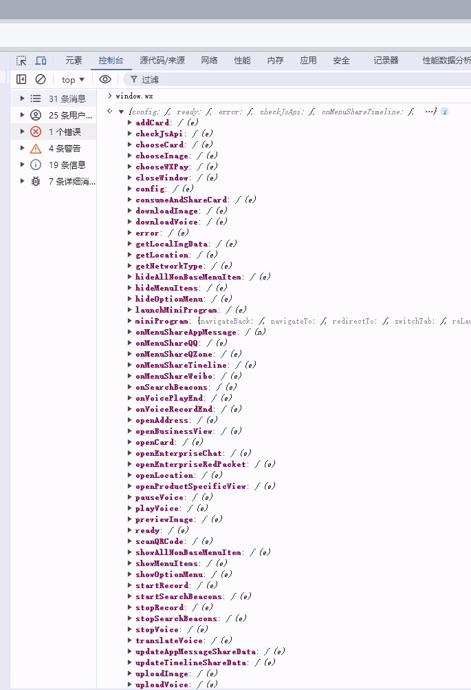
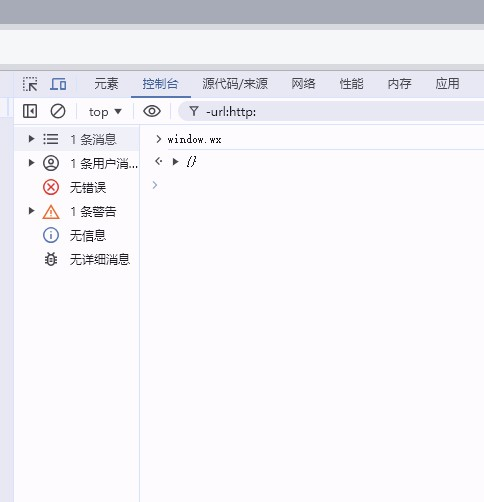
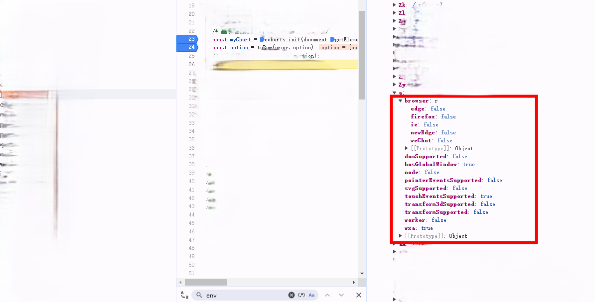

## 简介

> uni-app 框架（vue3）中使用 echarts 库的一次踩坑记录

## 背景

对于一套代码分别编译部署在小程序和 web 端的项目，最让人头疼的便是对各个平台进行代码兼容了，这次还整了个大活。

起因是产品要对小程序进行迭代升级，但是小程序里嵌入了`webview`页面，而且这个 web 页面还是当前项目部署在 web 移动端的页面；

结果就导致 开发需要同时兼顾 web 和小程序的代码兼容；在开发过程中还算顺利，本地看着都没啥问题，小程序表现也都还可以。

结果就在上线后的第二天下午，就发现这次升级的一个 web 页面 `echarts` 图渲染异常 如图:


## 主要内容

### 第一阶段-排查问题

查看线上报错 `TypeError: Cannot read properties of undefined (reading 'getDom'`，紧接着排查问题，由于只有线上报错本地启动的项目表现正常，只能挨个排查对应问题。

第一次 查到可能是由于 `vue3` 响应式变量导致 `echarts` 报错，遂修改后部署，部署成功后查看沙盒环境未修复。

在这个时候 我想到有可能是我在`echarts`的`option`配置属性`tooltip`中用到的`renderMod`属性导致的，于是修改后部署查看；好消息是`echarts`图渲染出来了,坏消息是`tooltip`失效了。（到这里我还以为是一个简单的小问题，丝毫没有意识到这是一个坑）


### 第二阶段-解决 tooltip 渲染问题？

线上无报错，本地运行项目浏览器预览移动端时 `tooltip` 表现正常，遂尝试本地运行打包后的项目排查问题。

经过本地运行打包后的项目，发现 `tooltip` 表现依然是正常的。

于是去检查`sentry`记录，排查下来 并无异常情况。

至此问题陷入僵局；在我对比了`react`项目中用的`echarts`版本和当前项目的`echarts`版本一致时；

我的脑海中突然闪过一个念头，会不会是`uni-app`导致的问题，遂去查找相关解决方案；

不查不知道，一查就发现有许多好兄弟也遇到过这种问题，具体的原因是：

> uni-app 框架会在全局`window`对象中注入`wx`属性，而`echarts`在初始化的时候会判断环境，由此来对交互操作进行限制

uni-app 在全局`window`中注入的`wx`属性：



echarts 源码中的环境变量`Env`初始化逻辑：

```js
var Env = (function () {
  function Env() {
    this.browser = new Browser()
    this.node = false
    this.wxa = false
    this.worker = false
    this.svgSupported = false
    this.touchEventsSupported = false
    this.pointerEventsSupported = false
    this.domSupported = false
    this.transformSupported = false
    this.transform3dSupported = false
    this.hasGlobalWindow = typeof window !== "undefined"
  }
  return Env
})()

var env = new Env()
if (typeof wx === "object" && typeof wx.getSystemInfoSync === "function") {
  //记住这一行
  env.wxa = true
  env.touchEventsSupported = true
} else if (typeof document === "undefined" && typeof self !== "undefined") {
  env.worker = true
} else if (
  typeof navigator === "undefined" ||
  navigator.userAgent.indexOf("Node.js") === 0
) {
  env.node = true
  env.svgSupported = true
} else {
  detect(navigator.userAgent, env)
}
function detect(ua, env) {
  var browser = env.browser
  var firefox = ua.match(/Firefox\/([\d.]+)/)
  var ie = ua.match(/MSIE\s([\d.]+)/) || ua.match(/Trident\/.+?rv:(([\d.]+))/)
  var edge = ua.match(/Edge?\/([\d.]+)/)
  var weChat = /micromessenger/i.test(ua)
  if (firefox) {
    browser.firefox = true
    browser.version = firefox[1]
  }
  if (ie) {
    browser.ie = true
    browser.version = ie[1]
  }
  if (edge) {
    browser.edge = true
    browser.version = edge[1]
    browser.newEdge = +edge[1].split(".")[0] > 18
  }
  if (weChat) {
    browser.weChat = true
  }
  env.svgSupported = typeof SVGRect !== "undefined"
  env.touchEventsSupported =
    "ontouchstart" in window && !browser.ie && !browser.edge
  env.pointerEventsSupported =
    "onpointerdown" in window &&
    (browser.edge || (browser.ie && +browser.version >= 11))
  env.domSupported = typeof document !== "undefined"
  var style = document.documentElement.style
  env.transform3dSupported =
    ((browser.ie && "transition" in style) ||
      browser.edge ||
      ("WebKitCSSMatrix" in window && "m11" in new WebKitCSSMatrix()) ||
      "MozPerspective" in style) &&
    !("OTransition" in style)
  env.transformSupported =
    env.transform3dSupported || (browser.ie && +browser.version >= 9)
}
```

<br/>

如此，便导致`echarts`对环境判断失误，导致我们的`echarts`图无法触发`tooltip`功能。

既然找到了问题的原因，那修复起来就应该是手拿把掐，直接在`main.js`中加上 `window.wx = {}`。

但是让我百思不得其解的是 为什么本地 运行的项目表现是正常的呢？

带着疑问，先把改动提交一下 部署到沙盒看看效果，先看看`window`对象中的`wx`属性还有没有



终于是没了，再看看`tooltip`是否生效了？

我满心欢喜的用鼠标点了点`echarts`图，结果却是一点反应没有。。。我崩溃了！！！

已知：这个问题是因为`echarts`环境判断代码导致的。

看来得拿出调试大法了，先在本地运行的项目中打上`debugger`找到对应`echarts`模块初始化对象中的`env`属性


然后再去沙盒环境找到对应的`env`属性



由此，可以确定环境判断的代码还走错了，继续调试 找到`echarts`源码判断宿主环境的那一行打上断点。


目前看起来是没啥问题，离谱的是 `typeof wx === 'object' && typeof wx.getSystemInfoSync === 'function'` 这个代码在线上环境执行时居然是`true`，最要命的是控制台输出的却是`false` 。。。。。 我整个人都裂开了 这 tm 到底是什么情况

到此算是明白为什么本地没问题，线上却一直有问题的原因了。

### 第三阶段-最终解决方案

在暴走边缘的我，想起来之前找解决方案时有好兄弟在 `echarts` 的 `github` 仓库中提了 `issue`；

很快啊 我直接冲进 `echarts` 源码仓库的 `issues` 中搜索 `typeof wx === 'object' && typeof wx.getSystemInfoSync === 'function'`


于是在这条 `issue` 里找到了最终解决方案


虽然在这里的代码改动`wx && (wx.getSystemInfoSync = undefined);`和之前的`window.wx = {}`差不多，但我还是决定将这段代码应用在项目中，并部署在沙盒。

最终奇迹出现了，`tooltip` 可以触发了，到此算是把这个 bug 解决了。


## 总结

经过数个小时的问题排查，从最开始的渲染问题到最后的 `uni-app` 往 `window` 对象中注入 `wx` 属性的问题，这其中的排查思路一步一步，对我来说都是一次可遇不可求的学习机会。相信自己以后再遇到这种问题就真的应该是手拿把掐了 哈哈哈哈。

虽然这个 bug 是解决了，可还有一个疑问没有解开：

```js
//wx && (wx.getSystemInfoSync = undefined);
//window.wx = {}
//为什么上面两行代码 在线上的echarts环境判断代码中 为什么会表现不一致呢

if (typeof wx === "object" && typeof wx.getSystemInfoSync === "function") {
  env.wxa = true
  env.touchEventsSupported = true
}
```

真是一个神奇的 bug
