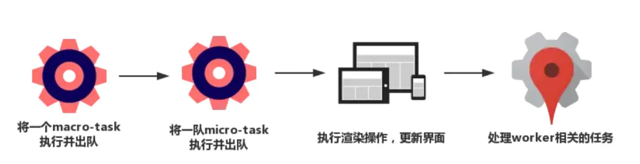
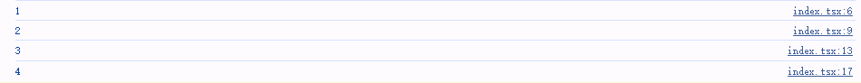
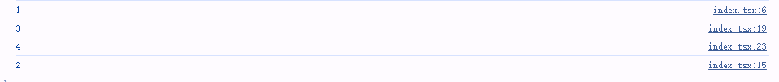
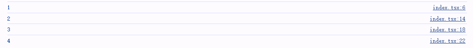
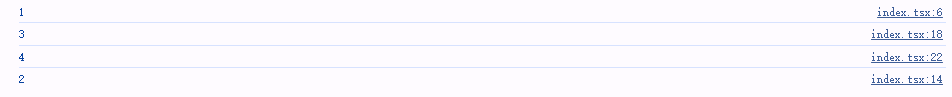

> 文章内demo使用的 react/react-dom 版本均为 `18.2.0`

## 简介

从最开始接触react时，我对useEffect的认识是——它的callback 通常会在浏览器完成渲染后被异步调用。

但是在开发过程慢慢的发现它并不是我最开始认识的那么简单，它也有一套属于自己的执行规则并不总是在页面渲染完后才会被异步调用，有时也许会在页面渲染前同步调用执行effect callback。

关于这个细节，我会在接下来的demo中一一演示一遍，并总结它的执行规则。

## 主要内容

### 渲染前执行的useEffect Callback

话不多说，直接上一个简单的demo看看useEffect执行时机

```tsx
//demo1
import { useEffect, useState } from "react";

const Test = () => {
    const [state] = useState(0)
	//render 方法调用时被触发
    console.log(1);
    //effect 中打印
    useEffect(()=>{
        console.log(2);
    },[state])
	//微任务中打印
    Promise.resolve().then(()=>{
        console.log(3);
    })
	//宏任务中打印
    setTimeout(() => {
        console.log(4);
    }, 0);

    return <>useEffect 执行时机</>
}

export default Test;
```

上边的 `<Test />` 中我们分别在 render 方法执行时、useEffect Callback 中、微任务的 Promise Callback 中以及 宏任务的 setTimeout Callback 中进行了不同的打印。

浏览器中存在一个 EventLoop 的事件渲染机制:



假设 useEffect 是异步，在渲染完成之后被调用，控制台打印的数字按顺序应该是 1、3、4、2.

控制台输出结果：



**实际的情况并非如此，按照打印顺序来讲。useEffect 是在 微任务之前被调用，这也就意味着 useEffect 实际是在渲染前被同步调用执行。**

### 渲染后执行的useEffect Callback

在上述代码中添加一段while渲染阻塞render方法：

```tsx
//demo2
import { useEffect, useState } from "react";

const Test = () => {
    const [state] = useState(0)
	//render 方法调用时被触发
    console.log(1);

    const flag = Date.now();
    while (Date.now() - flag < 100) {
      // block 阻塞
    }
    //effect 中打印
    useEffect(()=>{
        console.log(2);
    },[state])
	//微任务中打印
    Promise.resolve().then(()=>{
        console.log(3);
    })
	//宏任务中打印
    setTimeout(() => {
        console.log(4);
    }, 0);

    return <>useEffect 执行时机</>
}

export default Test;
```

相较于原始的 Demo 我们添加了一段 while 循环，让 render 函数阻塞了 100ms ;此时，再来看看控制台的打印结果：



- 
   控制台首先输出 1，这是因为 render 方法中的同步逻辑。 
-  之后，在渲染前的 微任务Promise Callback 会被执行，控制台会打印 3。 
-  再之后，伴随着 宏任务 执行完毕浏览器会执行页面渲染，渲染完成后会取出 宏任务 中的 setTimeout Callback 来执行，也是就控制台会输出 4。 
-  最后，useEffect Callback 会被执行输出 2（此时浏览器早经渲染完毕）。

整个 log 的打印顺序为 1、3、4、2，符合我过往的认知：useEffect 在浏览器渲染完成后才会异步执行，一切显得非常自然。

### useEffect Callback 在 UserEvent 中的表现

上述两个例子，我们讲述了在 `Test` 组件初次 render 后 useEffect 的执行时机。

在 React 中，对于 UserEvent 用户事件触发后的 Effect 执行也稍稍有些不同。

#### useEffect Callback 渲染前被执行

添加点击事件：

```tsx
//demo3
import { useEffect, useState } from 'react'

const Test = () => {
  const [state, setState] = useState(0)

  console.log(1)

  const flag = Date.now();
  while (Date.now() - flag < 100) {
    // block 阻塞
  }
  //effect 中打印
  useEffect(() => {
    console.log(2)
  }, [state])
  //微任务中打印
  Promise.resolve().then(() => {
    console.log(3)
  })
  //宏任务中打印
  setTimeout(() => {
    console.log(4)
  }, 0)

  return (
    <>
      <button onClick={() => setState((state) => state + 1)}>点击更新 state</button>
    </>
  )
}

export default Test

```

上述的代码中，我们为页面中额外添加了一个按钮 Button 元素。

当用户点击 Button 时在组件内部会更新 state ，从而触发依赖 state 的 useEffect 执行。

需要额外留意的是，同样我们在 Test 的 render 方法中增加了一段 100ms 的 block render while 循环。

当我们在浏览器中点击按钮时：



我们惊奇的发现，当产生用户事件后执行顺序和初次渲染时存在阻塞 while 循环的输出顺序又是不同了。

输出顺序为 1、2、3、4， useEffect Callback 的调用时间再一次变成了同步的顺序。

#### useEffect Callback 渲染后被执行

在上述的 Click Event 中 useEffect Callback 即使组件 render 中存在长时间 block 的逻辑也会被在页面渲染前同步调用。

那么 UserEvent 中被触发的 useEffect 中一定是会在页面渲染前才会被执行吗？接下来我们来看另一个不同的例子。

```tsx
//demo4
import { useEffect, useState } from 'react'

const Test = () => {
  const [state, setState] = useState(0)

  console.log(1)

  const flag = Date.now();
  while (Date.now() - flag < 100) {
    // block 阻塞
  }
  //effect 中打印
  useEffect(() => {
    console.log(2)
  }, [state])
  //微任务中打印
  Promise.resolve().then(() => {
    console.log(3)
  })
  //宏任务中打印
  setTimeout(() => {
    console.log(4)
  }, 0)

  return <div className="w-[100%] h-[300px] bg-[#6cc]" onMouseEnter={() => setState(10)}></div>
}

export default Test

```

我们将 UserEvent 从 click 修改成为 onMouseEnter ，将鼠标移入 div 元素时：



神奇，控制台的打印顺序变成了 1、3、4、2。

这也就意味着将代码中的 click 时间修改成为 onMouseEnter 后， useEffect 的执行时机从渲染前的同步变成了渲染后再执行的异步。

当鼠标移入 div 时，首先会触发 onMouseEnter 事件调用 `setState` 修改组件内部状态，自然由于 state 发生改变会导致 Test 组件 reRender 。

在 App 组件 reRender 时：

- 首先输入 1，render 中的同步逻辑。
- 其次输出 3，微任务 会在页面渲染前执行完毕。
- 之后输入 4，此时页面已经渲染完成了，会执行 宏任务。
- 最后，在执行 useEffect Callback 执行 2，同样也是在渲染完后执行。

## 总结

经过上面四个demo，可能许多人都开始犯迷糊了 useEffect究竟是同步还是异步执行呢？

其实，关于 useEffect 的执行调用时机并不是固定在渲染前还是渲染后的某个阶段。而是会按照一定的规律从而决定是在渲染前被同步被调用还是在渲染后被异步调用。

在 [React](https://cloud.tencent.com/developer/tools/blog-entry?target=https%3A%2F%2Flink.juejin.cn%2F%3Ftarget%3Dhttps%3A%2F%2Freact.dev%2Freference%2Freact%2FuseEffect%23caveats&source=article&objectId=2418672) 官方文档上关于 useEffect 有一段这样的简介：

> - If your Effect wasn’t caused by an interaction (like a click), React will generally let the browser **paint the updated screen first before running your Effect.**
> - Even if your Effect was caused by an interaction (like a click), **the browser may repaint the screen before processing the state updates inside your Effect.**

简单翻译过来说也就是说：

-  如果你的 Effect 并不是由于交互行为而被触发（比如我们前两个 Demo 中表示的），React 通常在 useEffect 执行之前将浏览器进行渲染（先执行屏幕渲染，在执行 Effect）。 
-  即使你的 Effect 是由于用户产生交互行为而被执行（比如点击事件后的状态改变执行 Effect，类似于最后一个 Demo 中），React 也可能会在 Effect 执行之前重新绘制屏幕（先进行页面渲染，在执行 Effect）。

可以看到文档中对于 Effect 的执行时机分为了两个不同的触发时机，分别：

- 非交互行为产生的 useEffect Callback 执行时机
- 交互行为下产生的 useEffect Callback 执行时机

针对这两种不同时机，我们分别来总结下 useEffect Callback 的执行规律。

### 非交互行为产生的 useEffect Callback 执行时机

对于非用户交互行为下被调用的 effect callback，就类似于我们上边描述过的 demo1 以及 demo2。

简单来说，在非用户交互触发下的 effect，React 内部会在渲染完毕后会在 workloop  中检查是否存在剩余时间来同步调用 effect。

**如果组件渲染花费太多的时间，比如 Demo2 中 render 函数中存在一个 100ms 的 while 循环，此时 React 在渲染完毕后会立即将主线程释放给浏览器，保证优先响应渲染。**

自然，由于屈服于主线程的原因 useEffect Callback 会被渲染后异步调用。

**相反，对于 Demo1 中的例子。由于渲染并没有浪费太多时间，渲染完毕后 workloop 仍然存在剩余时间则会尽可能在渲染前调用 effect Callback 执行。**

同样，这也是 Demo1 下输出 1、2、3、4 渲染前同步调用 effect callback 的原因。

### 交互行为下产生的 useEffect Callback 执行时机

对于用户交互行为下产生的 effect callback，类似于我们上述的 demo3 以及 demo4。

不过，在用户交互行为下被执行的 effect callback 稍微有一些细微的差异，这是 React 团队刻意而为之的。

简单来说，在事件体系中可以将不同的事件分为**离散型事件**和**非离散型事件**。

所谓离散事件也就意味着每个事件都是用户单独意图触发的，比如 demo3 中的点击事件，每一次点击都是用户单独意图触发的，假使用户点击两次，那么的确是因为用户有明确意图触发了两次点击。**

相反，所谓的非离散型事件，也被称之为“连续事件“。类似于 demo4 中的 onMouseEnter 事件。事件的多次触发并不是用户有意触发，站在用户角度来说用户并不关心执行了多少次 mouseEnter(mousemove) 事件，在用户的角度上仅仅是滑动过鼠标而已。这类事件 React 团队称之为 "continuous"，重要的是最新的事件而非发生了多少次，这类事件统一被称为非离散型（连续）事件。**

所以，在明确交互行为（用户事件产生）下的 effect Callback 可以按照事件类型划分不同的执行时机：

-  **对于离散型事件导致的 effect callback，React 内部会在渲染前同步处理 useEffect callback，effectCallback 被认为是在渲染前同步调用执行。** 
-  **对于连续性输入（非离散型）事件下的 effect callback， React 内部会按照非交互行为产生的 useEffect Callback 类似的处理方式：如果渲染结束后仍然存在剩余时间，则会尽可能的将 Effect Callback 同步调用，否则则会在渲染后将 effect callback 作为异步方式调用。** 

Andrew Clark 在 React18 的介绍中提到了这一过程 [New in 18: useEffect fires synchronously when it's the result of a discrete input](https://cloud.tencent.com/developer/tools/blog-entry?target=https%3A%2F%2Flink.juejin.cn%2F%3Ftarget%3Dhttps%3A%2F%2Fgithub.com%2Freactwg%2Freact-18%2Fdiscussions%2F128&source=article&objectId=2418672)，有兴趣的同学也可以结合文章内容一并查阅。
